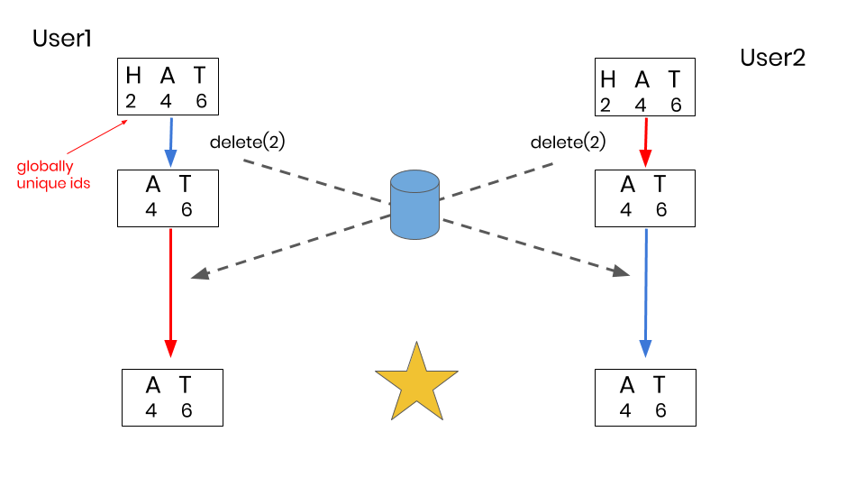

Conclave is a real-time, peer-to-peer, collaborative text editor built by software engineers [Elise Olivares](https://elisejane.github.io/), [Nitin Savant](http://www.nitinsavant.com), and [Sunny Beatteay](https://www.linkedin.com/in/sjbeatteay/).

[Click here](https://conclave-app.herokuapp.com/)  to start using Conclave right now!

---
<h2> Table of Contents </h2>

1. ToC
{:toc}

---
### Introduction

Intrigued by collaborative text editors, like Google Docs, we set out to build our own from scratch. This document walks you through the journey we traveled. From our initial idea, through our research of current academic literature, to our design and implementation of the final product.

---
### What is a text editor?

Let's quickly review what we mean by text editor. A text editor allows you to insert or delete characters and then save the resulting text to a file. Each character has a value and a integer index that determines its position within the document. For example, with the text "HAT", the character value "H" has position 0, "A" has position 1, and "T" has position 2.

A character can be inserted or deleted from the text simply by referencing a positional index. To insert a "C" at the beginning of the text, you perform the operation `insert("C", 0)`. To delete the "H", you perform the operation `delete(1)`. Note that depending on where a character is inserted or deleted, preceding or succeeding characters must update their positional indices.

<figure>
  <center>
    
  </center>
  <figcaption>
    <small><strong>Local positional indices change as you type.</strong></small>
  </figcaption>
</figure>

We first thought of using an HTML textarea as our text editor but soon realized that a simple textarea is not able to detect the index at which a letter is inserted or deleted. A specialized editor was needed.

We decided to use the open source [CodeMirror](https://github.com/codemirror/CodeMirror) text editor for it's ease of use and robust API.

---
### What is a collaborative text editor?

Let's say we have two users in two different locations who want to edit a document at the same time. To provide the feeling of a "real-time collaborative" experience, both users should be able to edit the document at any time (i.e. no locking) and all changes made by a user should be immediately available for them to see on their screen.

To provide this experience, we'll need to create a replica of the shared document at each user's location. When a user changes their document, the change should be immediately applied locally and then broadcasted to the other user.

Given these requirements, can we apply changes to our collaborative editor in the same manner as our single user text editor?

Let's try to insert "C" and delete "H" as we did in the previous example. This time, however, we'll have two different users apply one of the operations first and then apply the other operation received from the other user.

<figure>
  <center>
    
  </center>
  <figcaption>
    <small><strong>Insertion and deletion operations do not commute.</strong></small>
  </figcaption>
</figure>

Oh no! Each user's document looks different. This demonstrates that changing the order of operations produces different results. In mathematical terms, the operations do not commute (insert + delete !== delete + insert).

This time, let's say both users want to delete the "H" from "CHAT".

<figure>
  <center>
    
  </center>
  <figcaption>
    <small><strong>Duplicate deletion operations are not idempotent.</strong></small>
  </figcaption>
</figure>

Looks like that doesn't work either! While each user's document looks the same, they both ended up with "AT" instead of "CAT". This demonstrates that repeating the same operation multiple times produces different results. In mathematical terms, the delete operations are not idempotent.

It appears that we can't collaborate using indices like with a single user text editor. Since there are multiple users making changes to the same shared document, there is the possibility for changes to be made concurrently (or at the same time). Dealing with these conflicts so that each user sees a consistent and intentional result is the primary challenge of a collaborative text editor.

As demonstrated in the two examples above, our solution must satisfy the two mathematical properties of commutativity and idempotency.

- **Commutativity**: Multiple operations converge to the same result regardless of the order in which they are applied.
- **Idempotency**: Repeated operations produce the same result.

How can we solve this challenge?

---
### Operational Transformation (OT)

One possible solution we found is called Operational Transformation (OT). OT is an algorithm that compares concurrent operations and detects if they will cause the document state to diverge. It then modifies the operations so that they will merge together. We will represent OT as a "black box" for now.

Returning to an earlier example, when User1 receives the `delete(0)` operation from User2, OT realizes that since User1 inserted a new character at position 0, User2's operation must be transformed to `delete(1)` before being applied.

<figure>
  <center>
    
  </center>
  <figcaption>
    <small><strong>Insertion and deletion operations commute with OT.</strong></small>
  </figcaption>
</figure>

Without showing our other example, we can imagine that when a user tries to delete a character that's already been deleted, OT recognizes this and skips the operation. In basic terms, OT provides a strategy to achieve commutativity and idempotency.

Operational Transformation was the first popular way to allow for collaborative editing. The first collaborative editors, Google Wave, Etherpad, and Firepad, all relied on OT to work. Unfortunately, the verdict is that it's tough to implement.

> “Unfortunately, implementing OT sucks. There's a million algorithms with different tradeoffs, mostly trapped in academic papers. The algorithms are really hard and time consuming to implement correctly. […] Wave took 2 years to write and if we rewrote it today, it would take almost as long to write a second time.”

> Joseph Gentle (Google Wave / ShareJS Engineer)

---
### Conflict-Free Replicated Data Type (CRDT)

An alternative strategy called Conflict-Free Replicated Data Types (CRDTs) was discovered by academic researchers while trying to strengthen and simplify OT. While OT treats the text as a list of characters and relies on a complex algorithm to merge conflicts, the CRDT takes a different approach. It relies on a more complex data structure but with a much simpler algorithm.

The major difference with CRDTs is with how they create and store their characters. With one user typing in a text editor, each character requires only a value and a whole number positional index. In collaborative editing, we've seen that this simple requirement creates a couple problems with convergence and intention preservation.

Therefore, a CRDT adds the requirement that each character be globally unique. This is achieved by assigning a **Site ID** and **Operation Counter** properties to each character upon creation. Since the **Operation Counter** value increments every time it creates (or deletes) a character, we have ensured that every character object created in the system is globally unique.

With globally unique characters, when a user sends a message to another user to delete a character, it can indicate precisely which character to delete. Let's see how this changes our example.

<figure>
  <center>
    
  </center>
  <figcaption>
    <small><strong>Duplicate deletion operations are idempotent with a CRDT.</strong></small>
  </figcaption>
</figure>

The 2nd requirement of CRDTs is that each character created contains a position that is relative to the characters around it. This relative position never changes and can always be used to find the character's position in the document.

In the "CAT" example, when user inserts "H" at position 1, they are actually trying to convey that they intend to insert an "H" in between (or relative to) "C" and "A".

<figure>
  <center>
    
  </center>
  <figcaption>
    <small><strong>Positions are generated relative to the characters around it.</strong></small>
  </figcaption>
</figure>

CRDTs accomplish this by employing fractional indices. Instead of inserting the “H” at position 1, it’s inserted at position 0.5. No matter what happens to the surrounding characters, “H” will be created in a place that matches the user’s intention.

To represent fractional indices in code, we used a list of integers, otherwise known as position identifiers. We can use this list of position identifiers to locate the correct position that a character should be inserted into the document.

<figure>
  <center>
    
  </center>
  <figcaption>
    <small><strong>Indices are relative and fractional instead of absolute integers.</strong></small>
  </figcaption>
</figure>

Even though User2 simultaneously deletes "A" at position 1, "H" is still be placed after the "C". The user's intention is preserved and the documents converge to the same result. By using fractional indices, CRDTs improve the commutativity. The order of operations doesn't matter anymore.

Another way to imagine fractional indices is as a tree. As characters are inserted into the document, they are given available position IDs from the first level of the tree. However, if we try to create a position between two adjacent characters, we need to go to the next level of the tree and pick an available position from that level.

<figure>
  <center>
    
  </center>
  <figcaption>
    <small><strong>Relative positions are like a tree</strong></small>
  </figcaption>
</figure>

---
### Coding a CRDT

Talking about CRDTs in theory is well enough, but how does someone go about coding it? It's actually simpler than you might think.

A CRDT needs certain properties to be functional:
* A globally unique SiteID
* A data structure to house all the character objects.

Since each user will have their own copy of the CRDT on their machine, each CRDT needs to be identifiable using a unique SiteID. This makes it so all insert and delete operations can be tied back to a specific user.

Additionally, each CRDT needs to have a data structure that houses all the character objects. This can be as simple as an array or linked list or as complicated as a matrix or tree. We decided to use a simple linear array to make things easy for ourselves.

```javascript
  class CRDT {
    constructor(id) {
      this.siteId = id;
      this.struct = [];
    }
  }
```

A CRDT must handle 4 basic operations:
* Local Insert
* Local Delete
* Remote Insert
* Remote Delete

#### Local Operations

Local operations are operations that a user makes themselves in their text editor. Remote operations are operations received from other users that need to be incorporated in order to stay consistent.

**Local Insert**

When inserting a character locally, the only information needed is the character value and the index at which it is inserted. A new character object will then be created using that information and spliced into the CRDT array. Finally, the newly created character object will be returned so it can be broadcast to the other users.

```javascript
  class CRDT {
    // ...
    localInsert(value, index) {
      const char = this.generateChar(value, index);
      this.struct.splice(index, 0, char);

      return char;
    }
    // ...
  }
```

You may wonder what is happening under the hood of the `generateChar` method. The bulk of the `generateChar` logic is determining the relative position of the character object.

```javascript
  generateChar(val, index) {
    const posBefore = (this.struct[index - 1] && this.struct[index - 1].position) || [];
    const posAfter = (this.struct[index] && this.struct[index].position) || [];
    const newPos = this.generatePosBetween(posBefore, posAfter);
    // ...
  }
```

Since each character object's position is relative to the characters around it, the positions of the surrounding characters are used to generate a position for the new character.

As mentioned before, relative positions can be thought of as a tree structure. We took advantage of that structure to create a recursive algorithm that traverses down that tree to dynamically generate a position.

```javascript
  generatePosBetween(pos1, pos2, newPos=[]) {
    let id1 = pos1[0];
    let id2 = pos2[0];

    if (id2.digit - id1.digit > 1) {

      let newDigit = this.generateIdBetween(id1.digit, id2.digit);
      newPos.push(new Identifier(newDigit, this.siteId));
      return newPos;

    } else if (id2.digit - id1.digit === 1) {

      newPos.push(id1);
      return this.generatePosBetween(pos1.slice(1), pos2, newPos);

    }
  }
```

**Local Delete**

Luckily, deleting a character from the CRDT is not as complicated as inserting one. All that is needed is the index of the character. That index is used to splice out the character object and return it.

```javascript
  localDelete(idx) {
    return this.struct.splice(idx, 1)[0];
  }
```

#### Remote Operations

Remote operations are where each character object's relative position comes in handy. When a user receives an operation from another collaborator, it's up to their CRDT to find where to insert it.

To make this as efficient as possible, a binary search algorithm was implemented. The algorithm uses the character's relative position to find it's index in the array. Or, in the case of remote inserts, the binary search is used to find where it should be inserted.

If it is a remote insertion, the character value and index are returned in order to insert the letter into the editor. For remote deletions, only the index is returned.

```javascript
  remoteInsert(char) {
    const index = this.findInsertIndex(char);
    this.struct.splice(index, 0, char);

    return { char: char.value, index: index };
  }

  remoteDelete(char) {
    const index = this.findIndexByPosition(char);
    this.struct.splice(index, 1);

    return index;
  }
```

With a CRDT in place, our team was able to begin collaborating with one another. Our local operations would get sent to our relay server, which would then broadcast them out to the rest of the users. Those users would incorporate the changes and any conflicts would be seamlessly resolved due to the commutative and idempotent nature of CRDTs.

Eventual consistency was achieved. **HUZZAH!**

However, that wasn't the end of it. While building a CRDT and a simple central server relay were already rather challenging, we wondered how we could make our application even better.

---
### What are the limitations of using a central server?

The current system architecture relies on the client-server model of communication. It supports multiple users editing a shared document, and between all of our users lies a central server that acts as a relay by forwarding operations to every user in the network of that shared document.

<figure>
  <center>
    
  </center>
  <figcaption>
    <small><strong>Two users connected through a central relay server.</strong></small>
  </figcaption>
</figure>

We started with this model because it allowed us to first focus on resolving editing conflicts among users. Now that we had achieved that, could we change our application architecture to a better model? Before we get into what we changed, let's talk about the limitations of our current central server architecture.

The first limitation is that we currently have an unnecessarily high latency between users. All operations are currently routed through the server, so even if users are sitting right next to each other, they still must communicate with each other through the server.

For example, let's say we have two users sitting next to each other in Los Angeles while our server is located in New York. Even though the users could be just milliseconds apart, the time it takes to send a message between them is actually 200-300 ms. This latency directly impacts how "real-time" our application feels, and we want to reduce this as much as possible.

<figure>
  <center>
    
  </center>
  <figcaption>
    <small><strong>Latency across the United States.</strong></small>
  </figcaption>
</figure>

The second limitation is that a central server can be costly to scale. As the number of users increases, the amount of work the server must do increases accordingly. To support this, the server would require additional resources, which costs money. As a team creating an open source project, we wanted to minimize the financial cost as much as possible.

The third limitation is that the client-server model requires that users trust the server and anyone that has access to it with their data. That includes the application developers (us in this case), our hosting service, and potentially the government.

And finally, reliance on a central server creates a single point-of-failure. If the server were to go down, all users will immediately lose their ability to collaborate with each other.

---
### Peer-to-Peer Architecture

We can remove these limitations by switching to a peer-to-peer architecture where users send operations directly to each other. In a peer-to-peer system, rather than having one server and many clients, each user (or peer) can act as both a client and a server. This means that instead of relying on a server to relay operations, we can have our users perform that work for free (at least in terms of money). In other words, our users will be responsible for relaying operations to other users they're connected to.

<figure>
  <center>
    
  </center>
  <figcaption>
    <small><strong>Peer-to-peer message relay network.</strong></small>
  </figcaption>
</figure>

---
### How will users send messages directly to each other?

To allow nodes to send and receive messages, we used a technology called **WebRTC**. WebRTC is a protocol that was designed for real-time communication over peer-to-peer connections. It's primarily intended to support plugin-free audio or video calling but its simplicity makes it perfect for us even though we're really just sending text messages.

While WebRTC enables our users to talk directly to one another, a small server is required to initiate those peer-to-peer connections in a process called "signaling".

It's important to mention that while WebRTC relies on this  signaling server, no document content will ever travel through it. It’s simply used to initiate the connection. Once a connection is established, the server is actually no longer necessary.

When a user first opens Conclave, the application establishes a WebSocket connection with the server. Using that connection, the app "registers" with the signaling server, essentially letting it know where it's located. The server responds by assigning a random, unique **Peer ID** to the user. The application then uses the assigned Peer ID to create a **Sharing Link** to display to each user.

<figure>
  <center>
    
  </center>
  <figcaption>
    <small><strong>User gets assigned a Peer ID from signaling server.</strong></small>
  </figcaption>
</figure>

The link is unique to each user and is essentially a pointer to a particular user. A user can share their link with anyone, and upon clicking the link, the collaborator will automatically be connected to the user and able to collaborate on the shared document.

To implement signaling and WebRTC messaging, we used a library called [PeerJS](http://peerjs.com) which took care of a lot of this stuff behind the scenes for us. For example, when a user clicks another user's sharing link, it's essentially asking the signaling server to broker a connection between them. The server responds by providing the user with the other user's IP address, allowing the user to send messages to the other user.

Since most internet users use wireless routers, the public IP address is found using a STUN server. The connecting user then uses the IP address to establish a WebRTC connection, and once established, content can be sent directly between users. In the case that a connection with the STUN server cannot be made and the WebRTC connection fails, a TURN server is used as a backup to send operations between users.

<figure>
  <center>
    
  </center>
  <figcaption>
    <small><strong>Signaling server brokers WebRTC data connection.</strong></small>
  </figcaption>
</figure>

---
### Is WebRTC Secure?

One question we are often asked is *Is WebRTC secure and encrypted?* The answer is a resounding **YES**.

<figure>
  <center>
    
  </center>
  <figcaption>
    <small><strong>Courtesy of <a href="http://webrtc-security.github.io/">WebRTC Security</a></strong></small>
  </figcaption>
</figure>

WebRTC uses the **UDP** transport protocol. UDP is a lightweight message protocol that allows it to send messages quickly and without waiting for a response from the other user.

According to [WebRTC Security](http://webrtc-security.github.io/):

> Encryption is a mandatory feature of WebRTC, and is enforced on all components, including signaling mechanisms. Resultantly, all media streams sent over WebRTC are securely encrypted, enacted through standardised and well-known encryption protocols. The encryption protocol used depends on the channel type; data streams are encrypted using Datagram Transport Layer Security (DTLS) and media streams are encrypted using Secure Real-time Transport Protocol (SRTP).

We can safely say that all of the data that is transferred through Conclave is secure and protected from malicious man-in-the-middle attacks.

---
### Version Vector

One drawback to UDP is that it does not guarantee in-order packet delivery. That means that our messages may be received in a different order than they were sent. This presents a potential issue. What if a user receives a message to delete a particular character before it's actually inserted that  character?

Let's say we have 3 peers collaborating on a document. Two of the peers are next to each other while the third is far away. Peer1 types an "A" and sends the operation out to both peers. Since Peer2 is nearby, it quickly receives the operation but decides it doesn't like it and promptly deletes it.

<figure>
  <center>
    
  </center>
  <figcaption>
    <small><strong>Peer1 inserts a character and Peer2 immediately deletes it.</strong></small>
  </figcaption>
</figure>

Now both the insert and delete operations are on their way to Peer 3. But due to the unpredictability of the Internet, the delete operation races past the insert operation.

<figure>
  <center>
    
  </center>
  <figcaption>
    <small><strong>The delete operation arrives at Peer3 before the insert operation.</strong></small>
  </figcaption>
</figure>

What happens if the delete operation arrives at Peer3 before the insert operation? We wouldn't want to apply the delete first because there'd be nothing to delete and the operation would be lost. Later, when the insert is applied, Peer3's document would look different from the others. We need to find a way to wait to apply the delete operation only after we've applied the insert.

To solve the out-of-order messages problem, we built what's called a **Version Vector**. It sounds fancy but it's simply a strategy that tracks which operations we've received from each user.

Whenever an operation is sent out, in addition to the character object and whether it's an insertion or deletion, we also include the character's **Site ID** and **Operation Counter** value. The SiteID indicates who originally sent the operation, and the Counter indicates which operation number it is from that particular user.

When a peer receives a delete operation, it's immediately placed in a **Deletion Buffer**. If it were an insert, we could just apply it immediately. But with deletes, we have to make sure the character has been inserted first.

After every operation (insert or delete), the deletion buffer is "processed" to check if the characters have been inserted yet. In this example, the character has a SiteID of 1 and Counter of 24.

To perform this check, Peer3 consults its version vector. Since Peer3 has only seen 23 operations from Peer1, the delete operation will remain in the buffer.

<figure>
  <center>
    
  </center>
  <figcaption>
    <small><strong>The first time the buffer is processed, the delete operation isn't ready to be applied by Peer3. </strong></small>
  </figcaption>
</figure>

After some more time, the insert operation finally arrives at Peer3, and its version vector is updated to reflect that it's seen 24 operations from Peer1. Since we've received a new operation, we again process the deletion buffer. This time, when the deletion operation's character is compared to the version vector, the delete operation can be removed from the buffer and applied.

<figure>
  <center>
    
  </center>
  <figcaption>
    <small><strong>This time the delete operation can be applied by Peer3.</strong></small>
  </figcaption>
</figure>

The logic described above is contained in the code snippet below. In addition, we've added a guard clause that prevents us from applying duplicate operations. In our peer-to-peer network, since peers are tasked with relaying operations, it's possible that a peer will receive operations that it's already applied. For every operation, the version vector is used to check if an operation has already been applied, and if so, just skip it with an early return.

```javascript
  handleRemoteOperation(operation) {
    if (this.vector.hasBeenApplied(operation.version)) return;

    if (operation.type === 'insert') {
      this.applyOperation(operation);
    } else if (operation.type === 'delete') {
      this.buffer.push(operation);
    }

    this.processDeletionBuffer();
    this.broadcast.send(operation);
  }
```

At this point, we've described the major components of our system architecture. Within every instance of our application, a custom-built CRDT works together with a Version Vector to make sure our document replicas all converge. The Messenger is responsible for sending and receiving WebRTC messages. And of course, the Editor allows a user to interact with their local copy of the shared document.

<figure>
  <center>
    
  </center>
  <figcaption>
    <small><strong>Final System Architecture</strong></small>
  </figcaption>
</figure>

---
### Optimizations

As our team continued to use Conclave, we noticed many aspects of the user experience that needed to be improved. These areas of improvement can be broken down into three categories:

1. Editor Features
2. CRDT Structure
3. Peer-To-Peer Connection management

---
#### Editor Features

Just because our collaborative editor worked did not mean it was usable. It was minimal and lacked basic features. To increase user friendliness, we switched from our typical software engineering roles to focus on the product itself. Below is a list of the features that we incorporated.

##### Remote Cursors

Having several people edit a document at the same time can be a chaotic experience. It becomes even more hectic when you don't know who else is typing and where.

That is the situation we ran into. Without a way to identify other person on the page, users would end up writing over each other and turning the real time collaborative experience into a headache.

{: .center}


Remote cursors would solve this problem. Each user would be represented by a cursor with a unique color that identifies them and their place in the document.

However, implementing remote cursors in a decentralized environment poses a problem. Without a central database to keep track of each user's cursor, how do we keep the remote cursors consistent between all nodes while preventing different users from ending up with the same color?

Ensuring that users have unique cursors was as simple as adding an animal name to the cursor and having a large number of possible color/animal combinations.

{: .center}


To address the consistency issue, we ended up creating a simple modulo hashing algorithm that would reduce each user's ID into an index that mapped to a animal and color pairing.

```javascript
  addRemoteCursor() {
    // ...

    const color = generateItemFromHash(this.siteId, CSS_COLORS);
    const name = generateItemFromHash(this.siteId, ANIMALS);

    // ...
  }

  function generateItemFromHash(siteId, collection) {
    const hashIdx = hashAlgo(siteId, collection);

    return collection[hashIdx];
  }

  function hashAlgo(input, collection) {
    const filteredNum = input.toLowerCase().replace(/[a-z\-]/g, '');
    return Math.floor(filteredNum * 13) % collection.length;
  }
```

##### Video Chat

Since we were already using WebRTC for our data communication, we realized it would be relatively easy to add video chat capabilities to our site. It's often easier to communicate verbally and sometimes it's just nice to see a face.

{: .center}


Users can click on any animal name in their list of peers to place a call request. The receiving user is alerted and must click the animal name to answer the call. The video modal can be dragged around the screen and minimized with a click. Clicking the **x** ends the call and all media channels are closed. Each user can only be on a call with one other user at a time.

```javascript
  videoCall(id, ms) {
    navigator.mediaDevices.getUserMedia({audio: true, video: true})
    .then(ms => {
      if (!currentStream) {
        const callObj = peer.call(id, ms);
        callObj.on('stream', stream => {
          streamVideo(stream, callObj);
          callObj.on('close', () => {
            currentStream.localStream.getTracks().forEach(track => track.stop());
            currentStream = null;
          });
        });
      }
    });
  }
```

In order for WebRTC to detect the media devices (camera and speaker) of any computer trying to join a video call, the initial signaling must be conducted over HTTPS. This prompted us to switch our server configuration to support HTTPS, which was obviously a really good change.

##### Download and Upload

Since there is no server to store documents, we realized we needed to provide a way for users to save what they are working on to use elsewhere at another time. Creating download functionality was simple enough. Any user can download the current contents of the editor to their computers under a timestamped filename.

```javascript
  downloadButton.onclick = () => {
    const text = editor.value();
    const blob = new Blob([text], { type:"text/plain" });
    const link = document.createElement("a");

    link.style.display = "none";
    link.download = "Conclave-"+Date.now();
    link.href = window.URL.createObjectURL(blob);
    link.onclick = e => document.body.removeChild(e.target);

    document.body.appendChild(link);
    link.click();
  }
```

When the download button is clicked, the text in the editor is converted to a plain text blob object. An invisible link is created with its href property set to this blob as a URL and its download property set to the filename (Conclave and a timestamp). The link is added to the DOM, clicked, and then removed.

On the other hand, what if someone wants to continue editing a file they downloaded earlier or start with something other than a blank document? We decided to add the ability to upload a file, also. To prevent massive erasure and potential confusion, only a user who starts a new document will have the option to upload. Users join a collaboration session will not see the upload button.

```javascript
  fileSelect.onchange = () => {
    const file = document.querySelector("#file").files[0];
    const fileReader = new FileReader();
    fileReader.onload = (e) => {
      const fileText = e.target.result;
      localInsert(fileText, { line: 0, ch: 0 });
      replaceText(crdt.toText());
    }
    fileReader.readAsText(file, "UTF-8");
  }
```

We used javaScript's built-in FileReader to read the contents of the file selected for upload. The text is inserted into the user's CRDT and then the editor view is replaced entirely by the data in the CRDT. Updating the editor is fast but insertion into the data structure happens one character at a time, so large documents take quite a while. This is an area for future improvement.

---
#### CRDT Structure

As mentioned in the **Coding A CRDT** section of this case study, we initially used a linear array as the base of our CRDT. This structure works fine for small documents but becomes very inefficient once the text reaches a larger size. This is mainly due to shifting all the characters in the array whenever an insertion or deletion is performed.

Another issue we ran into is the slow communication between our CodeMirror editor and our CRDT. Whenever a character is inserted into or deleted from the editor, CodeMirror returns a position object that indicates which line that change was made on and the index on that line.

In order to use this object in our CRDT, it needs to be converted into a linear index. This involves retrieving the document, splitting it by new line characters, iterating over the lines and calculating the index. This process is reversed in the case of remote insertions/deletions.

{: .center}


That is a lot of overhead to find a simple index. This lead us to wonder what data structure would be more efficient for our CRDT. That’s when we realized the CodeMirror editor itself is structured as a two-dimensional array.

{: .center}


If we built our CRDT to match the layout of our editor, we could get rid of that overhead. It turns out it has a lot of other benefits as well.

{: .center}


Search went from **O(log N)** — N being all the characters in the document — to **O(log L + log C)** — L being the total number of lines and C being the number of characters in that line.

We were able to do this by using two binary searches - one to find the correct line and the other to find the character in that line.

In the case of inserting and deleting, the worst time complexity for linear arrays is **O(N)** due to shifting, but it’s only **O(C)** for two-dimensional arrays because only the characters in that line need to shifted.

Finally, we were able to reduce the Find Index complexity from **O(N)** to **O(1)** because we can pass the position object that CodeMirror returns directly to the CRDT without any need of linearization or conversion.

We even wrote test scripts and recorded how long it took each structure to complete the script. Here are the results:

{: .center}


Where it took our original CRDT upwards of 14 seconds to complete about 100 thousand operations, our improved two-dimensional structure can do it in less than a second.

We were pretty happy with that.

---
#### Peer-To-Peer Connection Management

The third optimization we made was with how we managed WebRTC connections between users. While WebRTC allows users to connect directly to each other, it’s up to the developer to manage those connections and distribute them through the network.

---

**Sidenote:** We define *"network"* as the web of peer-to-peer connections. In this context, the *"network"* is only made up of users --  there are no servers.

---

One problem we ran into was users getting stranded or cut off from the network. Say we have three users, like in the diagram below.

{: .center}


Peer 2 and Peer 3 are connected through Peer 1, who acts as the message relay.

But what if Peer 1 leaves?

{: .center}


Now Peer 2 and Peer 3 are stranded and they can no longer collaborate.

In order to resolve this situation, we need to have a way for peers to discover each other. So that's what we made.

##### Network List and Peer Discovery

The solution we came up with was to have each peer keep a list of all the other users in the network. This list gets updated whenever users join and leave so that it’s always up to date.

{: .center}


This allows each user to know of all the other users, even if they’re not directly connected to each other. Now, if a user they are connected to leaves, they can pick someone random from the list and connect to them, allowing for the editing session to continue.

{: .center}


Is it possible to avoid a single point of failure in the first place? After all, that was part of the purpose of creating a peer-to-peer network.

##### Load Balancing

Connections can be more evenly distributed if they are evaluated and load balanced as they come in. A maximum number of connections has to be set for each user. If a new person wants to join the network, they send a connection request first.

{: .center}


Whoever receives the request will evaluate it to see if they have reached the maximum number of connections. If they have, they will forward the request to someone else in the network. If they haven't, they will connect back.

```javascript
  evaluateRequest(peerId, siteId) {
    if (this.hasReachedMax()) {
      this.forwardConnRequest(peerId, siteId);
    } else {
      this.acceptConnRequest(peerId, siteId);
    }
  }
```

<figure>
  <center>
    
  </center>
  <figcaption>
    <small><strong>Forwarded Connection Request</strong></small>
  </figcaption>
</figure>

**What is the maximum number of connections?**

To answer that question, we had to calculate what was the average number of connections we wanted every user to have. Since the network can grow and change, a fixed number (**O(1)**) would not be reliable. At the same time, having each user connected to every person in the network (**O(N)**) could cause bandwidth issues. We decided that a logarithmic scale (**O(log(N))**) was ideal.

However, through testing and trial-and-error, we discovered that a logarithmic scale can cause unusual bugs when the network is less than 5 users. Therefore, we use 5 connections as our baseline and when the network grows beyond the point, it switches back to logarithmic growth.

```javascript
  hasReachedMax() {
    const logNetwork = Math.ceil(Math.log(this.network.length));
    const tooManyConns = this.connections.length > Math.max(logNetwork, 5);

    return tooManyConns;
  }
```

Load balancing is not a perfect solution. While it does remove a single point of failure, it doesn't prevent bottlenecks from being formed. There are further optimizations that can be made, which leads to the next section.

---
### Future Plans

This is an ongoing project and the Conclave Team has several plans in store.

**Better Connection Distribution**

The first thing to further improve would be the connection distribution for users in the network. A possibility we are entertaining is to have newcomers connect to more than one person initially. This will prevent collaborators from falling into limbo if one of their connections drops and forces them to find a new peer.

**Mass insertions and deletions**

Right now our CRDT can only insert and delete one character at a time. Being able to add or remove chunks of text at once will drastically improve overhead and improve the efficiency of large cuts and pastes (as well as uploads).

**Automatic testing for P2P network**

Testing the peer-to-peer nature of Conclave is difficult. The majority of our bug finding has been through manual testing, which is inefficient and risky. Unfortunately, in order to simulate real world latency and scenarios, we would need to buy server space in data centers across the country and world. It is feasible, but we don't currently have the resources to achieve such a feat.

**Atom plug-in and embeddable browser editor**

{: .center}


Finally, you may have heard of the recent release of GitHub’s Teletype. We were really excited about the news because it also utilizes WebRTC and CRDTs. Furthermore, it gave us the idea to create our own Atom plugin, or at least an embeddable collaborative editor for the browser. It would not be too difficult to pull off. Keep an eye out for that!

---
### Conclusion

We hope you enjoyed reading about our journey as much as we enjoyed the journey itself!

All of us are available for new opportunities, so please feel free to reach out!


