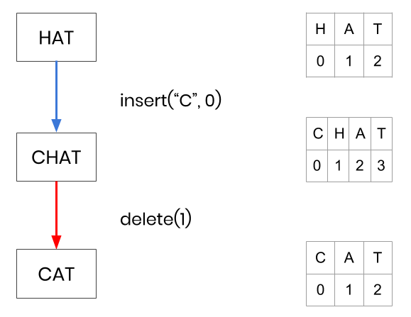

[Conclave](https://conclave-app.herokuapp.com/) is a real-time, peer-to-peer, collaborative text editor built by software engineers Elise Olivares, Nitin Savant, and Sunny Beatteay.

Intrigued by collaborative text editors, like Google Docs, we set out to build our own from scratch. This document walks you through the journey we took from our initial idea through our research of current academic literature to our design and implementation of the final product.

### What is a text editor?

Let's quickly review what we mean by text editor. A text editor basically allows you to insert or delete characters and then save the resulting text to a file. Each character has a value and a whole number index that determines its position within all other characters. For example, with the text "HAT", the character value "H" has position 0, "A" has position 1, and "T" has position 2.

A character can be inserted or deleted from the text simply by referencing a positional index. To insert a "C" at the beginning of the text, you perform the operation `insert("C", 0)`, and to then delete the "H", you perform the operation `delete(1)`. Note that depending on where a character is inserted or deleted, preceding or succeeding characters must update their positional indices.

![one]"" alt="position indices" />
  

  <figcaption>Indices change as you type</figcaption>
</figure>

Format: 
<small>
**Indices change as you type**
</small>

### What is a collaborative text editor?

Let's say we now have two users in two different locations who want to edit a document at the same time. To provide the feeling of a "real-time collaborative" experience, both users should be able to edit the document at any time (i.e. no locking) and all changes made by a user should be immediately available for them to see on their screen.

To provide this experience, we'll need to create a replica of the shared document at each user location. And when a user changes their document, the change should be immediately applied locally and then broadcast to the other user.

Given these requirements, can we apply changes to our collaborative editor in the same manner as our single user text editor?

Let's try to insert "C" and delete "H" as we did in the previous example. This time, however, we'll have two different users apply one of the operations first and then apply the other operation received from the other user.

INSERT IMAGE OF TRYING TO INSERT AND DELETE SIMULTANEOUSLY

Oh no! Each user's document looks different. This demonstrates that changing the order of operations produces different results. In mathematical terms, the operations do not commute (A + B !== B + A).

This time, let's say both users want to delete the "H" from "CHAT".

INSERT IMAGE OF TRYIGN TO DELETE THE SAME CHARACTER

Oh no! While each user's document looks the same, they both ended up with "AT" instead of "CAT". This demonstrates that repeating the same operation multiple times produces different results. In mathematical terms, the delete operations are not idempotent (A * 1 * 1 !== A).

It appears that we can't just use indices like a single user text editor. Since there are multiple users making changes to the same shared document, there is the possibility for changes to be made concurrently (or at the same time). Dealing with these conflicts so that each user sees a consistent and sensible result is the primary challenge of collaborative text editor.

As demonstrated in the two examples above, our solution must satisfy the two mathematical properties of commutativity and idempotency.

- **Commutativity**: Multiple operations converge to the same result regardless of the order in which they are applied.
- **Idempotency**: Repeated operations produce the same result.

How can we solve this challenge?

### Operational Transformation

One solution is that instead of blindly applying received operations, we first compare it to recent operations, and modify (or transform) it if necessary. This strategy is naturally called Operational Transformation (OT), and we'll represent it as a "black box" for now.

Returning to an earlier example, when User1 receives the `delete(0)` operation from User2, OT realizes that since User1 inserted a new character at position 0, User2's operation must be transformed to `delete(1)` before being applied.

INSERT OT EXAMPLE OF CONCURRENT INSERT/DELETE

Without showing our other example, we can imagine that when a user tries to delete a character that's already been deleted, OT recognizes this and skips the operation. So, in basic terms, OT provides a strategy to achieve commutativity and idempotency.

Operational Transformation was the first popular way to allow for collaborative editing. The first wave of collaborative editors, Google Wave, Etherpad, and Firepad, all relied on the OT to work. Unfortunately, the verdict is that it's tough to implement.

  “Unfortunately, implementing OT sucks. There's a million algorithms with different tradeoffs, mostly trapped in academic papers. The algorithms are really hard and time consuming to implement correctly. […] Wave took 2 years to write and if we rewrote it today, it would take almost as long to write a second time.”

  - Joseph Gentle (Google Wave / ShareJS Engineer)

An alternative strategy called Conflict-Free Replicated Data Types (CRDTs) were discovered by academic researchers while trying to strengthen and simplify OT. While OT treats the text as a list of characters and relies on a complex algorithm to merge conflicts, the CRDT takes a different approach. It relies on a more complex data structure but with a much simpler algorithm.

### CRDTs

The major difference with CRDTs is with how they create and store their characters. With one user typing in a text editor, each character requires only a value and a whole number positional index. In collaborative editing, we've seen that this simple requirement creates a couple problems with convergence and intention preservation.

Therefore, a CRDT adds the requirement that each character be globally unique. This is achieved by assigning **Site ID** and **Operation Counter** properties to each character upon creation. Since the **Operation Counter** value increments every time it creates (or deletes) a character, we're ensured that every character object created in the system is globally unique.

With globally unique characters, when a user sends a message to another user to delete a character, it can indicate precisely which character to delete. Let's see how this changes our example.

NEW IMAGE OF BOTH USERS DELETING THE SAME CHARACTER

The 2nd requirement that CRDTs add is providing the global relative position of each created character object.

CRDTs accomplish this by employing fractional indices. Instead of inserting the "H" at position 1, it's inserted at position 0.5. No matter what happens to the surrounding characters, "H" will be created in a place that matches the user's intention. Let's see how this changes our example.

In the "CAT" example, when user inserts "H" at position 1, they are actually trying to convey that they intend to insert an "H" in between (or relation to) "C" and "A".

NEW IMAGE OF USERS INSERTING AND DELETING NEARBY CHARACTERS

Even though User2 simultaneously deletes "A" at position 1, "H" is still be placed after the "C". The user's intention is preserved and the documents converge to the same result. By using fractional indices, CRDTs improve the commutativity; the order of operations doesn't matter anymore.

At this point, we have a real-time, collaborative text editor. Our editor allows multiple users to edit the same document, and it resolves conflicts by using CRDTs to achieve both commutativity and idempotency of its operations. Building that that was pretty challenging by itself. But we wondered how we could make our application even better?

### What are the limitations of using a central server?

The current system architecture relies on the client-server model of communication. At the center of our many users lies a central server that acts as a relay to deliver operations to every user in the network.

INSERT IMAGE OF CLIENT-SERVER RELAY ARCHITECTURE

We identified four main limitations with this design. The first is that all operations must be routed through the central server, even if users are sitting right next to each other. At best, this doubles the network latency of an operation. At worst, if two users are sitting next to each other in L.A. while the server is located in New York, the time to send a message between users skyrockets from just a few ms to 200-300 ms.

INSERT IMAGE OF US MAP AND LATENCY SPEEDS

The second limitation is that a central server is costly to scale. As the number of users increases, the amount of operations that must be relayed increases accordingly. To support this increase in work, the server would require additional resources which costs money.

The third limitation is that this design requires that our users trust the central server and anyone that has access to it. That could include the application developers (us in this case), the hosting service, and the government.

And finally, a central server introduces a single point-of-failure. If the server were to go down, all users immediately lose their ability to collaborate with each other.

### Peer-to-Peer Architecture

We can remove these limitations by switching to a peer-to-peer architecture where users broadcast operations directly to each other. In a peer-to-peer system, rather than having one server and many clients, each user (or node) can act as both a client and a server. Instead of relying on a central server to send and receive operations, we can have our users perform that work for free (at least in terms of $).

INSERT IMAGE OF P2P NETWORK

For our collaborative text editor, this means that instead of simply broadcasting local operations and applying remote operations, our nodes will also do what the server was original role of relaying operations to any other nodes they're connected to.

### How will users send messages directly to each other?

To allow nodes to send and receive messages to and from each other, we decided to use the **WebRTC** protocol. WebRTC was designed to for plugin-free real-time communication over peer-to-peer connections. It's primarily intended to support audio or video calling but its simplicity makes it pretty perfect for our use case.

While WebRTC enables our users to communicate directly, a small central server is required to initiate the connection between users in a process called "signaling". When a user first opens Conclave, the application establishes a WebSocket connection with the server. Using that connection, the app "registers" with the signaling server, essentially letting it know where it's located. The server responds by assigning a random, unique **Peer ID** to the user.

The application uses that Peer ID to create and display a "Sharing Link" to the user. The user can share their specific link with anyone, and upon clicking that link, another user will automatically be connected to the user and able to collaborate on the document.

To implement the signaling and WebRTC messaging, we used a library called [PeerJS](http://peerjs.com). It takes care of a lot of this stuff behind the scenes for us. For example, when a user attempts to connect to another user, the signaling server brokers the connection by providing the target user's location (or IP address) to the connecting user. The connecting user then uses the IP address to establish a **UDP** connection, and once established, content can be sent directly between users.

INSERT IMAGE OF SIGNALING PROCESS

It's critical to understand that while WebRTC relies on a central signaling server, no document content travels through the server. It’s simply used to initiate a connection between users. Once a connection is established, the server is no longer necessary to the connected users.

### Version Vector

Since UDP does not guarantee in-order packet delivery, our messages may be received in a different order than they were sent. This presents a problem. What if a user receives a delete message before it receives the message to actually insert that character?

INSERT IMAGE OF USER RECEIVING A DELETE BEFORE INSERT

To solve the out-of-order messages problem, we implemented what's called a **Version Vector**. It's a fancy name for a simple strategy that tracks which operations we've received from each user.

When a user broadcasts an operation, they also send along their **Site ID** and **Operation Counter** value. The Site ID indicates who originally sent the operation, and the Operation Counter indicates what number operation it is. The receiver can then look in its version vector to see if this operation is ready to be applied, or if it needs to wait to receive other operations first.

In our specific use case, there's no reason we can't apply insert operations immediately after receiving them. But we cannot apply a delete operation until we receive and apply it's corresponding insert operation first. So in the meantime, we place the delete operation in a **Deletion Buffer** until it's ready to be applied.

At this point, we now have a real-time, peer-to-peer, collaborative text editor. Our editor doesn't rely on a central server to deliver messages and is even resilient to out-of-order delivery of messages. Moving forward, we wondered how else we could improve our existing design. To answer this question, we began testing our app to see if we could discover any additional limitations that we could address.

### Performance Testing

### NITINS NOTES FOR OPTIMIZATION SECTION

The way our app works is that a user opens Conclave and is provided with an empty document and a link to share access to that document. The sharing link can be given to fellow collaborators through any means (e.g. text, email, Slack), and when a person clicks the link, they can view and edit the shared document. The sharing link is essentially a pointer to a specific peer, allowing you to connect to that peer. Once connected, any changes that person makes to their version of the document are sent to you and any change you make to your version of the document are sent to them.

When the 2nd person launched an instance of the app, even though they are using the same shared document, they are actually given a unique sharing link with their own unique id pointing to them. When a 3rd person uses the 2nd person’s sharing link, all operations are routed through the 2nd person. Therefore when the 3rd person makes a change, it gets sent to the 2nd person, who then relays that change to the person they were connected to.

As a peer, as long as you are connected to at least one other peer in the network, you should receive changes made by any peer, and changes you make should eventually reach every peer.

INSERT DIAGRAM OF THIS

CRDTSync: The first issue we found is when a peer joins the network after other peers have been already collaborating on the document. The new peer needs to be provided a copy of the CRDT from one of the peers in the network. When a new peer attempts to join the shared document by connecting to a target peer, the target peer responds by sending a copy of their CRDT and version vector to the new peer.

findNewTarget: In our initial design, when someone shares their link with other users, those users will connect to that initial peer thereby sending and receiving operations through that peer and any other peers that connect to it later. What if that initial peer decides to leave the network? The other peers become stranded and can no longer send and receive changes to each other. To solve this, we introduced a network list that every peer keeps track of. Every time a new peer enters the network, a message is relayed around the network so that each peer can add that new peer to their network list. Now, in the event that one of your connections leaves the network, you have a list of peers that you can connect with to remain a part of the web.

In the case of 2 peers connected to 1 root peer, if the root peer leaves, both remaining peers attempt to find a new target. The one that goes faster finds the other peer as the possible target and attempts to connect. The other peer accepts the request and adds to its connections. By the time the other one tries to connect, it doesn’t have any possible targets and so it doesn’t connect to anyone and also doesn’t have to since it was connected to.

Network Balancing: To solve this, we introduced the idea of a "connection request". When a new peer clicks an existing peer's sharing link, it doesn't automatically connect to them. Instead, it requests a connection. The peer receiving this request then evaluates whether it wants to accept the request or forward the request on to another peer in the network. If the peer's number of connections is greater than half the network (or 5), then it won't accept the request. Let's show an example.

INSERT DIAGRAM

In this diagram, 3 peers are connected to the root peer. When a 3rd peer attempts to connect, the root peer has 3 existing connections which is greater than half the network (4/2 = 2). Therefore, instead of accepting the connection request, it will forward the request to one of its other connections, resulting in a more balanced network. Now if any peer were to leave the room, there would still be a way for the remaining peers to communicate.

Outgoing Buffer: Whenever a CRDT sync is received from a peer or a CRDT sync completion notification is received from a peer, the outgoing buffer is processed. The buffer has been collecting the operations that were received from other peers while the sync request/process was in progress.

When a peer responds to a Sync request, it sends its CRDT and version vector to a peer. But while that syncing peer is loading the CRDT into its editor, new operations are being received by the responding peer. Any operations received by the responding peer are added to an outgoing buffer. Once the responding peer receives acknowledgement that sync is complete, it processes the buffer and sends all the buffered operations to that syncing peer.

It looks like we always add insert/delete operations to the outgoing buffer just in case we have a peer that is syncing a CRDT we've sent them. If so, we send them more operations by "processing the outgoing buffer" once we receive word that they've completed their sync. Couldn't they also just have an incoming buffer that isn't processed until their sync is complete on their end?

QUESTION: Why do we need to process the outgoing buffer when receiving a syncResponse, in other words, when receiving a CRDT sync object from a peer who's accepted our connection request. This assumes that we have received insert or delete operations from a peer while waiting for someone to send us a CRDT. Can that happen? If we are waiting for someone to respond to our connection request, we don't have any incoming connections so no one is sending us operations that we'll need to send.

ANSWER: It’s not actually for a SyncResponse. It’s for the case when one of our connections disconnects from us and we need to find a new Target (because we have fewer than 5).

When any one of a peer’s connections closes, it removes it from its connections list. If that peer was its refreshURL, it updates the URL with another peer’s sharing link (if it has an incoming connection to do that with). And finally, if it has less than 5 connections, it finds a new target. This also includes a case where it has zero connections and is in “limbo”. While in limbo, it’s not receiving operations from other peers and it’s not sending local operations to other peers.

To find a new target, it finds a list of peers in the network that we’re not already connected to, and we send a connection request randomly to one of them. If we’re the only one left in the network, then there are no possible targets, and we just wait for someone to try to connect to us before updating our page URL.Cs

QUESTION: What if we sent the received operation to our connections before we applied it to our CRDT? It feels like we're adding network latency by waiting for our local CRDT/editor behavior to complete before relaying operations to other peers.

ANSWER: Because we have to wait for the VV to be updated. If we broadcast before inserting/deleting, then one of our peers could process it and send it back to us before we finished processing and updating the VV. It is unlikely to happen, like it only happens if our computer is extremely slow compared to theirs. But it guarantees that we don’t accidentally apply a duplicate.
